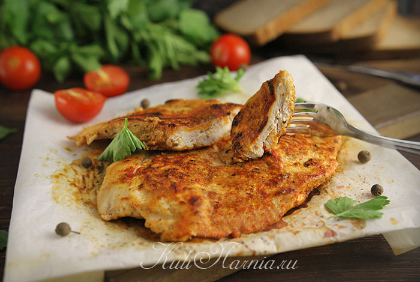
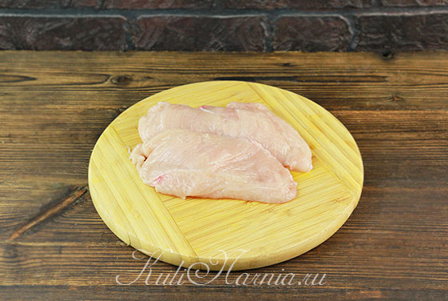
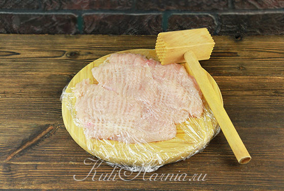
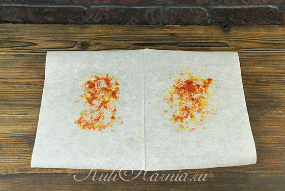
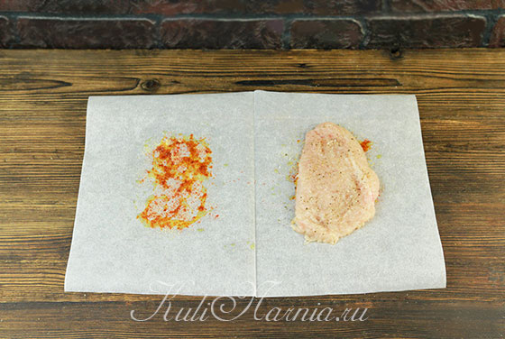
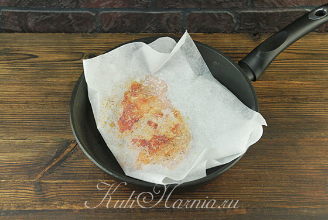
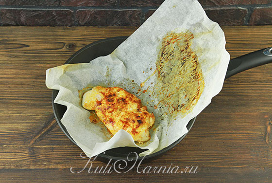

# Куриное филе в пергаменте на сковородке

## Ингредиенты
-   курица — 1 крупное филе (около 300 г);
-   растительное масло — 2 ч. ложки;
-   паприка молотая — 1 ч. ложка;
-   чеснок сухой (порошок) — 1 ч. ложка;
-   соль, перец — по вкусу.

## Шаг 1.
Филе моем в холодной воде и просушиваем, затем разрезаем вдоль пополам. Получаем две заготовки примерно одинакового размера.

## Шаг 2.
Слегка отбиваем куски — достаточно с одной стороны. Предварительно прикрываем куриное мясо пищевой пленкой, чтобы сохранить в чистоте рабочее место.

## Шаг 3.

От рулона пергаментной бумаги отрезаем кусок и складываем пополам. В сложенном виде бумага должна быть больше размера отбитого филе, чтобы мясо уместилось полностью в подготовленный «конверт» и по краям еще оставалось свободное место. Раскрываем бумагу и с обеих сторон от сгиба (то есть места, с которыми будет соприкасаться филе) смазываем 1 ч. ложкой растительного масла. Смазанные части присыпаем половиной порции чесночного порошка и сладкой паприки. Сухие пряности моментально «приклеиваются» к масляной поверхности, дополнительно их втирать нет необходимости. Во время жарки добавки насытят курицу ароматом, а яркая паприка добавит еще и цвет, сделав блеклое филе ярким и аппетитным. По желанию можно задействовать и другие специи/пряности.

## Шаг 4. 

Одну куриную отбивную выкладываем на место с маслом и пряностями. Сверху присыпаем мясо солью и перцем.

## Шаг 5. 

Накрываем отбивную второй половиной листа и переносим на сухую раскаленную сковороду с толстым дном. Держим на сильном огне 3 минуты (максимум 4), затем переворачиваем. В течение 3 минут доводим до готовности вторую сторону.

## Шаг 6.

Раскрыв бумагу, видим аппетитное готовое куриное мясо. Снимаем филе со сковороды и переносим на тарелку. На новом листе бумаги подготавливаем вторую порцию, жарим аналогично.

## Шаг 7.

Подаем в горячем виде, по желанию дополняем гарниром.

