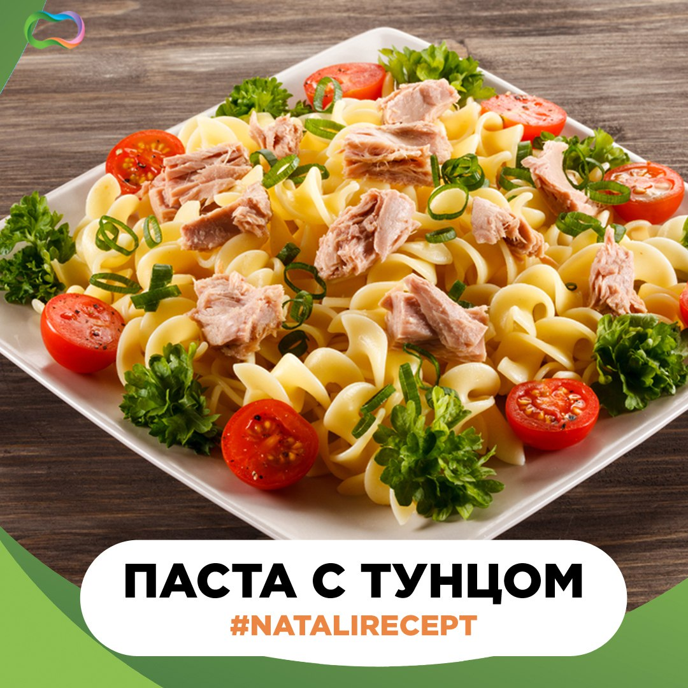

# Паста с тунцом

## Ингредиенты:  

- Паста из твердых сортов пшеницы  
- Тунец в собственном соку  
- Помидоры черри  
- Маслины  
- Перец болгарский  
- Петрушка свежая  

### Для заправки:  

- Чеснок-по вкусу  
-  Оливковое масло- 1 ст.л  
-  Лимонный сок- 1 ст.л.  
-  Базилик сушеный 1 ч.л.  
-  Соль, перец  
-  Лимонная цедра- ½ ч.л.  

## Шаг 1.

Пасту отварить до состояния «аль денте». 

## Шаг 2.

Сладкий перец нарезать кубиками и добавить к пасте. 

## Шаг 3.

Туда же добавить кусочки тунца, порезанные пополам томаты черри и маслины. 

## Шаг 4.

Добавить мелко порезанную зелень. 

## Шаг 5.

Смешать оливковое мало с лимонным соком, выдавить чеснок и положить лимонную цедру. 

## Шаг 6.

Перемешать и заправить пасту.