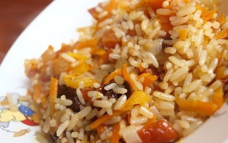

# Плов (рис) с сухофруктами

## Ингредиенты:  
- рис — 200 г  
- курага — 1 горсть  
- финик — 10 шт.  
- чернослив — 2-3 шт.

## Шаг 1.

Для приготовления плова с сухофруктами рис отварить или приготовить в пароварке до полуготовности (в пароварке 20-25 минут).  
  
 ## Шаг 2.
 
Сухофрукты помыть и порезать.  
  
 ## Шаг 3.
 
Орехи измельчить.  
 
 
 ## Шаг 4.
 
К рису добавить сухофрукты и орехи и доварить до готовности (в пароварке поставить еще на 20 минут).  
  
   ## Шаг 5.
   
Дать настояться.

