# Сливочный суп с грибами и плавленым сыром

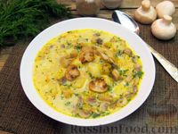

## Ингредиенты
- Шампиньоны - 400 г
- Сыр плавленый - 150 г
- Сливки 10-15% - 100 г
- Картофель - 400 г
- Лук-порей - 100 г
- Морковь - 100 г
- Масло оливковое - 2 ст. ложки (30 мл)
- Чеснок - 1-2 зубчика
- Укроп свежий - 25 г
- Соль - по вкусу
- Перец черный молотый - по вкусу
- Вода - 1 л

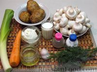

## Шаг 1.  

Грибы нарезаем небольшими кубиками.

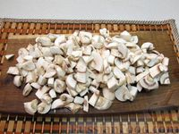

## Шаг 2.

Лук-порей нарезаем колечками.  
Морковь очищаем и натираем на крупной терке.

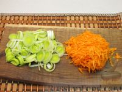

## Шаг 3.

В сковороде разогреваем оливковое масло и обжариваем лук с морковью около 4 минут, до мягкости.

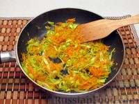

 ## Шаг 4.
 
Затем добавляем в сковороду грибы.

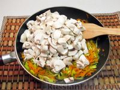

## Шаг 5.

Чеснок очищаем, измельчаем ножом и добавляем в сковороду. Все перемешиваем.

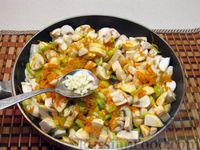

## Шаг 6.

Обжариваем овощи с грибами около 7 минут, пока полностью не испарится жидкость.

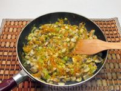

## Шаг 7.

Картофель очищаем и нарезаем небольшими кусочками.

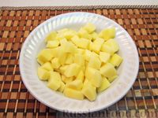

## Шаг 8.

В кастрюлю выкладываем содержимое сковороды и картофель.

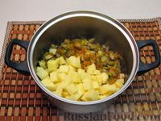

## Шаг 9.

Заливаем водой, доводим до кипения и варим 10 минут.

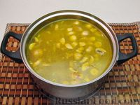

## Шаг 10.

После этого добавляем в суп плавленый сыр.

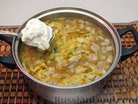

## Шаг 11.

Варим суп еще 5 минут. За пару минут до конца приготовления добавляем соль.

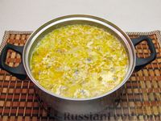

## Шаг 12.

В суп вливаем сливки, доводим до кипения и выключаем нагрев.

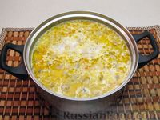

## Шаг 13.

Зелень укропа мелко нарезаем.  
После этого в суп добавляем измельченный укроп и черный молотый перец.

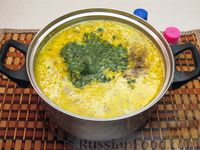

## Шаг 14.

Накрываем суп крышкой и оставляем на 10 минут.
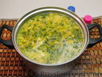

## Шаг 15.

Готовый сливочный суп с грибами и плавленым сыром разливаем по тарелкам и подаем к столу. Приятного аппетита!

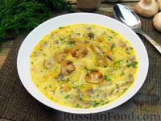
