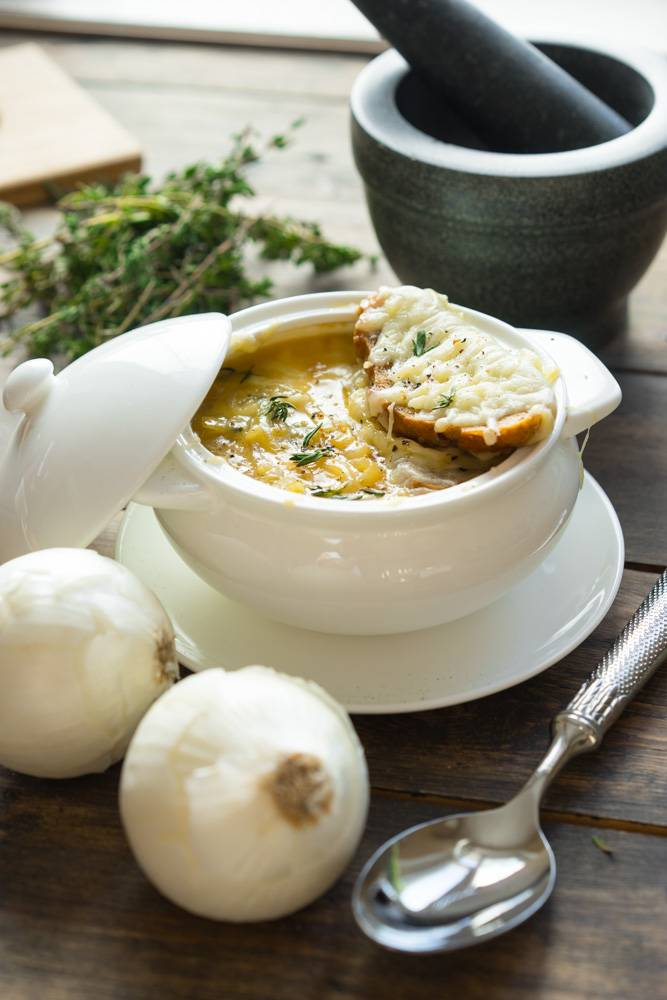
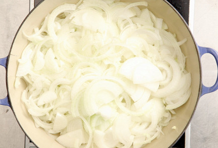
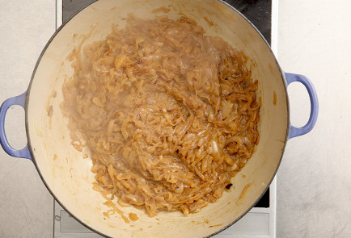
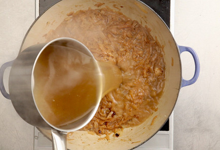
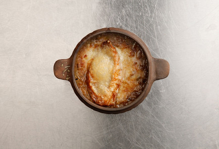

# Классический французский луковый суп

# Ингредиенты

- Сливочное масло - 50 г
- Репчатый лук - 4 головки
- Пшеничная мука - 1 ст.л.
- Белое сухое вино - 200 мл
- Куриный бульон - 1.5 л.
- Французский багет - 1 шт.
- Сыр грюйер - 150 г

## Шаг 1.

В большой толстостенной кастрюле растопить сливочное масло и отправить туда лук, нарезанный полукольцами. Обжаривать, помешивая, пока он не станет прозрачным.

## Шаг 2.

Сделать огонь потише и продолжать жарить лук, время от времени помешивая и следя, чтобы он не подгорал. Цель — добиться карамельного оттенка лука и не пережаренной, а мягкой, почти невесомой консистенции. Слегка обжарить на сухой сковородке муку. Как только мука начнет менять цвет и пахнуть жареным орехом, тут же ссыпать ее в кастрюлю с луком и тщательно в лук вмешать.

## Шаг 3.

Теперь остается вылить в кастрюлю сначала вино, смешанное с сахаром, дать луку минуту покипеть вместе с вином, а потом разбавить их компанию бульоном (приготовить самостоятельно) или водой — по желанию. Довести до кипения и варить на очень медленном огне пятнадцать-двадцать минут. Перемешать и добавить оставшуюся воду. Довести до кипения, снять накипь и варить на медленном огне пятнадцать минут.

## Шаг 4.
Разложить куски багета на противне и посыпать их тертым сыром. Поставить в духовку на три-четыре минуты, чтобы сыр расплавился и слегка подрумянился. Подавать суп в глубоких тарелках с плавающими и постепенно набухающими гренками.

